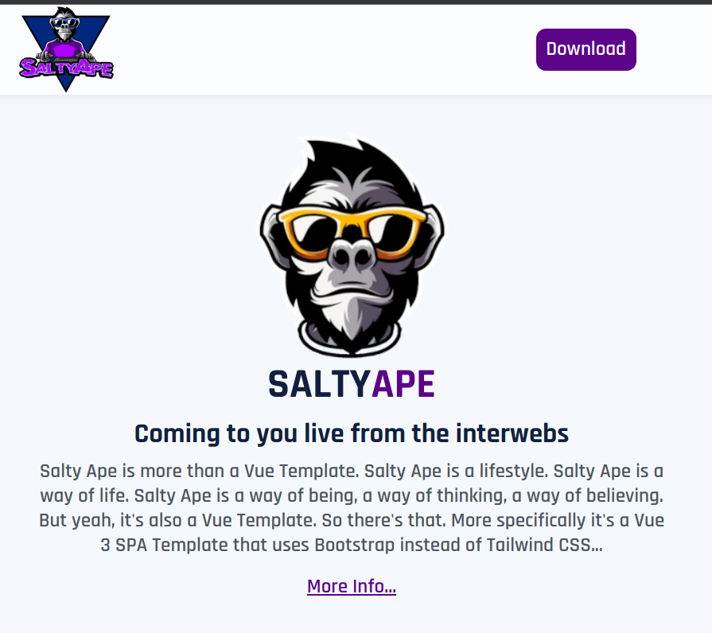

# Salty Ape

Salty Ape is more than a Vue Template. 
- Salty Ape is a lifestyle. 
- Salty Ape is a way of life. 
- Salty Ape is a way of being, a way of thinking, a way of believing. 

But yeah, it's also a Vue Template. So there's that. More specifically it's a Vue 3 SPA Template that uses Bootstrap instead of Tailwind CSS.

### See it in action: [SaltyApe.com](https://saltyape.com/)

## Why did you make this?

My [frontend.us template](https://github.com/TripKendall/front-end) was starting to show its age and I needed a break from Tailwind... I wanted something fresh. Something that I could grab and instantly get started with.

Unlike my previous free templates this one is a SPA - no router, views, etc. All the code is in /components called by app.vue. As simple as it gets so that it's as flexible and versatile as it can be. I'm sure I'll need a version with VueRouter and views at some point and will add that as a branch.

This is provided as is - feel free to clone and use this template for whatever you want but there is no warranty or support. It's free, it's open source, it's yours to do with what it you will. If you want to contribute, please do. I'll review and merge any pull requests that make sense.